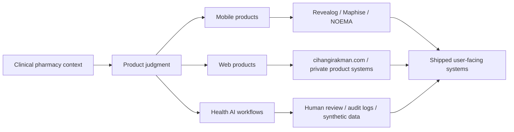

# Cihangir Akman

### Clinical pharmacist and founder building health, beauty, AI, mobile, and web products.

  
  
  

I build at the intersection of clinical pharmacy, product strategy, mobile software, web systems, and responsible AI. My work focuses on production-minded products, clear decision boundaries, and systems that can be reviewed, operated, and improved with evidence.

---

## Profile Snapshot

| Clinical base | Product execution | AI boundary |
| --- | --- | --- |
| MSc Clinical Pharmacy, pharmacy ownership, dermocosmetic and patient-facing practice. | Full-stack product delivery across iOS, Android, web, backend, release, and operational workflows. | Human review, audit logs, synthetic data, explainability, and disciplined health-claim boundaries. |

## Main Portfolio

| Work | Role | Links |
| --- | --- | --- |
| **cihangirakman.com** | Personal founder/product site showing my products, credentials, health AI projects, and operating philosophy. | [Website](https://cihangirakman.com) |
| **Revealog** | Non-medical skincare diary for routines, progress photos, product records, notes, and visual progress tracking. | [Website](https://revealog.com) [App Store](https://apps.apple.com/tr/app/revealog/id6749480130) [Google Play](https://play.google.com/store/apps/details?id=com.revealog.app) |
| **Maphise** | Map-based social discovery product built around intent, place, context, and fit. | [App Store](https://apps.apple.com/app/id6763642475) |
| **NOEMA** | Mobile reflection app built around AI mentor-style conversations, journaling, and personality context. | [Legal / Support](https://pharmacist65.github.io/noema-legal/) [GitHub](https://github.com/Pharmacist65/noema-legal) |
| **Clinical Intake AI Workflow** | Human-reviewed clinical intake workflow with review signals, priority flags, and audit logs. | [GitHub](https://github.com/Pharmacist65/clinical-intake-ai-workflow) |
| **Regional Preventive Health Analytics** | Privacy-first public health analytics system using synthetic aggregate data and explainable risk signals. | [GitHub](https://github.com/Pharmacist65/regional-health-risk-ai) [Demo](https://regional-health-risk-ai-ikqhu3ynfpabw2emgxg6br.streamlit.app/) |
| **Private Product Systems** | Web applications, admin tools, and product infrastructure developed in private repositories, spanning data modeling, auth, deployment, and operational workflows. | Private GitHub repos |

## Product System Map

## Stack By Context

| Context | Tools I use |
| --- | --- |
| Mobile products | React Native, Expo, TypeScript, JavaScript, app store release workflows |
| Product infrastructure | Firebase for mobile auth/backend/hosting workflows; Supabase for PostgreSQL-style database, auth, and API workflows when that architecture fits |
| Backend and data | ASP.NET Core, C#, Python, Streamlit, SQLite, PostgreSQL |
| Workflow | Git, GitHub Actions, Vite, testing, documentation, deployment checklists |

  
  
  
  
  
  
  
  
  

## Education And Background

- MSc Clinical Pharmacy - Marmara University
- Bachelor of Pharmacy - Hacettepe University
- AI Management & Product Strategy - VAO AI Program
- Associate Degree in Computer Programming - Istanbul University AUZEF, ongoing
- Founder / Product Lead - Sedecio Pharma A.S.
- Pharmacy Owner / Specialist Pharmacist - Defne Pharmacy
- Co-founder - Laurel Beauty Store

## Operating Principles

- Production value over surface area.
- Human review where automation affects health-related decisions.
- Disciplined claims in health, beauty, and AI products.
- Evidence-led iteration after controlled releases.
- Auditability, reviewability, and operational clarity by default.

## GitHub Activity

## Connect

- Website: [cihangirakman.com](https://cihangirakman.com)
- LinkedIn: [linkedin.com/in/cihangir-akman-612680267](https://www.linkedin.com/in/cihangir-akman-612680267/)
- Email: [cihangir.akman@hotmail.com](mailto:cihangir.akman@hotmail.com)
